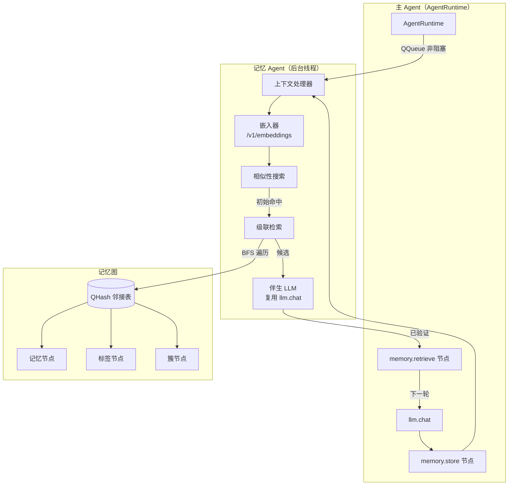
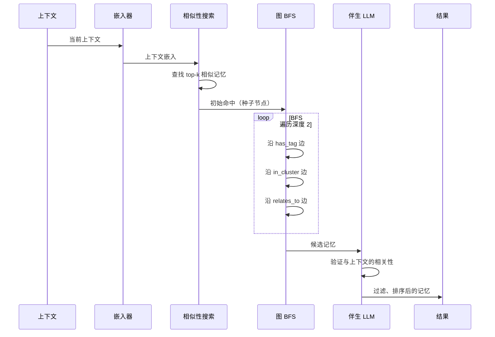
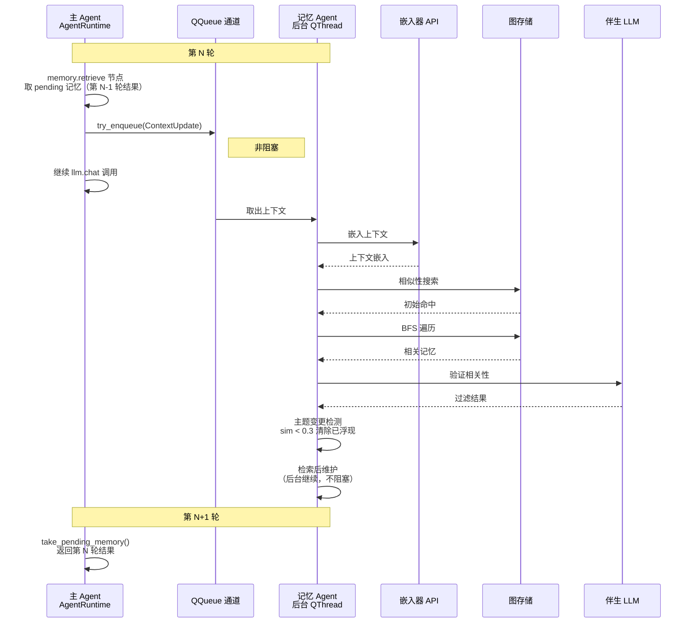

# VPet 记忆架构设计（基于 jcode 记忆架构适配）

> **状态：** 设计文档（阶段 1 待实现）
> **日期：** 2026-08-01
> **参考：** jcode.md 记忆架构（E:\Agents\Memory_structures\jcode.md）
> **定位：** 跨会话学习的多层记忆系统，模仿人类记忆——相关记忆在触发时"浮现"，而非显式回忆。

---

## 1. 概述

### 1.1 设计目标

- 配置要求小：不引入独立向量数据库、不引入额外本地模型，尽量复用现有组件
- 规避传统向量库问题：纯向量检索会出现"语义向量相近但意思完全相反"的噪声；本架构用 **LLM 伴生验证** 过滤
- 避免信息丢失：级联检索（嵌入命中 → BFS 图遍历）能找回纯向量检索丢掉的关联记忆

### 1.2 关键设计决策

1. **完全异步且非阻塞** —— 主 Agent 从不等待记忆；第 N 轮的结果在第 N+1 轮可用
2. **基于图的组织** —— 记忆形成连通图，包含标签（Tag）、簇（Cluster）和语义链接（Link）
3. **级联检索** —— 嵌入命中触发 BFS 遍历以查找相关记忆
4. **混合分组** —— 结合显式标签、自动簇和语义链接

### 1.3 与 jcode 的差异适配

| 组件 | jcode（Rust） | VPet 适配（C++/Qt） | 理由 |
|---|---|---|---|
| 嵌入器 | tract-onnx 本地 all-MiniLM-L6-v2 | **复用文本 LLM 提供商的 `/v1/embeddings` 接口** | 零新增配置、零本地模型；远期可换 ONNX Runtime 离线 |
| 伴生服务 | 独立 GPT-5.3 Codex Spark | **复用现有 `llm.chat`** | 验证相关性、提取记忆、矛盾检测共用同一 LLM |
| 图存储 | HashMap 邻接表 + JSON | `QHash` + `QJsonDocument` 序列化 | 与 jcode 同思路（比图库更简单的 JSON 序列化） |
| 异步 | tokio + mpsc try_send | `QThread` 后台线程 + `QQueue` + `try_enqueue` | 非阻塞、结果延迟一轮可用 |
| 作用域 | global / project / session | **global / pet / session** | 桌宠无"项目"概念，改为"宠物"级 |
| 集成方式 | CLI 工具 `jcode memory` | **DAG 节点**（`memory.retrieve` / `memory.store`） | 融入 FL Studio 式客制化管线 |

---

## 2. 架构概览



---

## 3. 基于图的数据模型

### 3.1 节点类型

| 节点类型 | 描述 | 存储 |
|---|---|---|
| **记忆（Memory）** | 核心记忆条目（事实、偏好、流程、修正） | 内容、元数据、嵌入 |
| **标签（Tag）** | 显式标签（用户定义或推断） | 名称、描述、计数 |
| **簇（Cluster）** | 通过嵌入相似性自动分组 | 质心嵌入、成员计数 |

### 3.2 边类型

| 边类型 | 从 → 到 | 描述 | 检索权重 |
|---|---|---|---|
| `has_tag` | 记忆 → 标签 | 记忆具有此显式标签 | 0.8（强信号） |
| `in_cluster` | 记忆 → 簇 | 记忆属于自动发现的簇 | 0.6（中等信号） |
| `relates_to` | 记忆 → 记忆 | 语义关系（加权 0.0-1.0） | 边权重 |
| `supersedes` | 记忆 → 记忆 | 新记忆替换旧记忆 | 0.9（非常相关） |
| `contradicts` | 记忆 → 记忆 | 冲突信息（两者都保留，但标记） | 0.3 |
| `derived_from` | 记忆 → 记忆 | 程序性知识由事实派生 | 0.3 |

### 3.3 C++ 实现

```cpp
// 节点
struct _tagMemoryNode {
    QString id;
    enum Kind { Memory, Tag, Cluster } kind;
    // Memory: MemoryEntry 内容
    // Tag:    名称、描述、计数
    // Cluster:质心嵌入、成员计数
};

// 边
struct _tagMemoryEdge {
    QString fromId;
    QString toId;
    enum Kind { HasTag, InCluster, RelatesTo, Supersedes, Contradicts, DerivedFrom } kind;
    float weight = 1.0f; // RelatesTo 的语义权重
};

// 记忆图：HashMap 邻接表（与 jcode 同思路，JSON 序列化简单）
struct _tagMemoryGraph {
    QHash<QString, _tagMemoryNode> nodes;
    QVector<_tagMemoryEdge> edges;
    QHash<QString, QVector<QString>> adjacency; // fromId -> [toId]
    // 快速查找索引
    QHash<QString, QString> memoryIndex;   // memoryId -> nodeId
    QHash<QString, QString> tagIndex;      // tagName -> nodeId
    QHash<QString, QString> clusterIndex;  // clusterId -> nodeId
};
```

---

## 4. 混合分组系统

三种互补的组织方法：

### 4.1 标签（显式）

**来源：**
- 用户显式标记：`memory { action: "remember", tags: ["喜欢", "工作"] }`
- 从上下文推断（主题、实体）
- 由伴生 LLM 在会话结束时处理提取

**桌宠场景示例：**
- `#user` —— 用户相关
- `#pet` —— 宠物自身相关
- `#preference` / `#correction` —— 类别标签
- `#game` / `#work` / `#study` —— 领域标签

### 4.2 簇（自动）

基于嵌入相似性自动发现的分组。

**算法：**
1. 定期在记忆嵌入上运行聚类（初期用 k-means，数据量增长后可评估 HDBSCAN）
2. 为密集区域创建/更新簇节点
3. 为附近的记忆分配 `in_cluster` 边
4. 跟踪簇质心以便快速查找

**优势：**
- 发现用户未显式标记的隐藏模式
- 即使没有共享标签也能对相关记忆分组
- 支持"查找相似"查询

### 4.3 链接（语义关系）

记忆之间的显式关系：

- **relates_to**：一般语义连接（权重 0.0-1.0）
- **supersedes**：新信息替换旧信息（旧记忆标记 `superseded_by`，但保留）
- **contradicts**：冲突信息（两者都保留，但标记，供后续巩固解决）
- **derived_from**：程序性知识由事实派生

**发现方式：**
- 写入时的矛盾检测（伴生 LLM）
- 伴生 LLM 在验证期间识别关系
- 用户可以显式链接记忆

---

## 5. 级联检索

当上下文触发记忆搜索时，级联检索通过图遍历查找相关记忆。

### 5.1 流程



### 5.2 算法（C++ 伪代码）

```cpp
struct _tagRetrievalResult {
    MemoryEntry entry;
    float score;
};

QVector<_tagRetrievalResult> CascadeRetrieve(
    const QVector<float> &contextEmbedding,
    int maxDepth,
    int maxResults)
{
    // 步骤 1：嵌入相似性搜索（余弦相似度）
    auto initialHits = SimilaritySearch(contextEmbedding, 10);

    // 步骤 2：从命中点开始 BFS 遍历
    QSet<QString> visited;
    QVector<std::tuple<QString, float, int>> candidates; // (nodeId, score, depth)
    QQueue<std::pair<QString, int>> queue;

    for (const auto &[nodeId, score] : initialHits) {
        queue.enqueue({nodeId, 0});
        candidates.append({nodeId, score, 0});
    }

    while (!queue.isEmpty()) {
        auto [nodeId, depth] = queue.dequeue();
        if (depth >= maxDepth || visited.contains(nodeId)) continue;
        visited.insert(nodeId);

        for (const auto &edge : graph.adjacency[nodeId]) {
            const QString &neighborId = edge.toId;
            if (visited.contains(neighborId)) continue;

            float edgeWeight = EdgeWeight(edge.kind); // has_tag=0.8, in_cluster=0.6,
                                                      // supersedes=0.9, contradicts=0.3,
                                                      // relates_to=weight, derived_from=0.3
            // 按深度衰减分数
            float decayedScore = edgeWeight * std::pow(0.7f, depth + 1);

            if (graph.nodes[neighborId].kind == _tagMemoryNode::Memory) {
                candidates.append({neighborId, decayedScore, depth + 1});
            }
            queue.enqueue({neighborId, depth + 1});
        }
    }

    // 步骤 3：去重、排序并返回 top 结果
    std::sort(candidates.begin(), candidates.end(),
              [](auto &a, auto &b) { return std::get<1>(a) > std::get<1>(b); });
    QVector<_tagRetrievalResult> results;
    for (const auto &[nodeId, score, depth] : candidates) {
        if (graph.nodes[nodeId].kind == _tagMemoryNode::Memory) {
            results.append({graph.nodes[nodeId].memoryEntry, score});
            if (results.size() >= maxResults) break;
        }
    }
    return results;
}
```

### 5.3 检索参数

| 参数 | 默认值 | 描述 |
|---|---|---|
| `similarity_threshold` | 0.4 | 初始命中的最小嵌入相似性 |
| `max_initial_hits` | 10 | 嵌入搜索结果数量 |
| `max_depth` | 2 | BFS 遍历深度限制 |
| `max_results` | 10 | 返回的最终结果数 |
| `edge_decay` | 0.7 | 每遍历一步的分数衰减 |

---

## 6. 记忆条目模式

### 6.1 C++ 数据结构

```cpp
struct _tagMemoryEntry {
    // 身份
    QString id;
    QString content;
    QString category;

    // 分类
    enum MemoryType { Fact, Preference, Procedure, Correction, Negative };
    MemoryType memoryType;              // 事实/偏好/流程/修正/负面
    enum MemoryScope { Global, Pet, Session };
    MemoryScope scope;                  // 全局/宠物/会话

    // 来源跟踪
    QString sessionId;
    struct _tagReinforcement {          // 强化面包屑
        QString sessionId;
        int messageIndex;
        qint64 timestamp;
    };
    QVector<_tagReinforcement> reinforcements;
    enum Provenance { UserStated, UserCorrected, Observed, Inferred, Extracted };
    Provenance provenance;              // 用户陈述/用户纠正/观察/推断/提取

    // 生命周期
    qint64 createdAt;      // epoch ms
    qint64 updatedAt;
    qint64 lastAccessed;
    quint32 accessCount = 0;
    quint32 strength = 0;              // 巩固计数

    // 信任与状态
    float confidence = 1.0f;           // 0.0-1.0，随时间衰减
    float trustScore = 1.0f;           // 基于来源的信任
    bool active = true;
    QString supersededBy;

    // 负面记忆专用
    QStringList triggerPatterns;       // 触发模式（关键字/正则）

    // 程序性记忆专用
    struct _tagProcedure {
        QString name;
        QString trigger;
        QStringList steps;
        QStringList prerequisites;
        QStringList warnings;
    };
    std::optional<_tagProcedure> procedure;

    // 嵌入
    QVector<float> embedding;          // 可延迟回填
};
```

### 6.2 记忆类型与来源

| MemoryType | 示例（桌宠场景） | 半衰期 |
|---|---|---|
| Fact | "用户在写 Qt 项目" | 30 天 |
| Preference | "用户喜欢简洁的回答" | 90 天 |
| Procedure | "用户早上 9 点开始工作" | 60 天 |
| Correction | "不要说教" | 365 天 |
| Negative | "不要在用户开会时搭话" | 365 天 |
| Inferred | （由上下文推断的低置信度记忆） | 7 天 |

| Provenance | 含义 |
|---|---|
| UserStated | 用户明确说过 |
| UserCorrected | 用户纠正了桌宠行为 |
| Observed | 桌宠从行为中观察到 |
| Inferred | 桌宠从上下文中推断 |
| Extracted | 从会话摘要中提取 |

### 6.3 信任权重

- `UserStated` / `UserCorrected` → trustScore 1.0
- `Observed` → 0.8
- `Extracted` → 0.7
- `Inferred` → 0.5

---

## 7. 高级特性

### 7.1 时间感知

近期提升公式（检索排序时应用）：

```
boost = 1.0 + (0.5 * e^(-hours_since_access / 24))
```

### 7.2 置信度衰减

```
confidence = initial_confidence * e^(-age_days / half_life)
           * (1 + 0.1 * log(access_count + 1))
           * trust_weight
```

半衰期表见 6.2（Correction=365 天、Preference=90 天、Fact=30 天、Procedure=60 天、Inferred=7 天）。

### 7.3 负面记忆

桌宠应避免做的事情，`triggerPatterns` 匹配当前上下文时浮现（如 "开会"、"忙"）。

### 7.4 来源跟踪

每条记忆跟踪 `reinforcements` 面包屑（session_id, message_index, timestamp），记录每次被强化/引用的来源。

### 7.5 反馈循环

```cpp
void MemoryEntry::OnUsed(bool helpful) {
    accessCount++;
    lastAccessed = now();
    if (helpful) {
        strength++;
        confidence = qMin(confidence + 0.05f, 1.0f);
    } else {
        confidence = qMax(confidence - 0.1f, 0.0f);
    }
}
```

### 7.6 主题变更检测

- 每轮计算当前上下文嵌入与上一轮嵌入的余弦相似度
- `sim < 0.3` 视为主题切换 → 清除已浮现记忆集合，避免跨主题记忆污染

### 7.7 作用域级别

| 作用域 | 生命周期 | 示例 |
|---|---|---|
| Global | 永久 | "用户偏好简洁回答" |
| Pet | 直到删除 | "这只桌宠叫 XX，喜欢 XX 颜色" |
| Session | 当前会话 | "用户正在做某件事" |

检索时按作用域过滤：Session 记忆只在本会话有效，Pet 记忆永远参与，Global 记忆永远参与。

---

## 8. 异步处理流水线

### 8.1 时序



### 8.2 要点

- 记忆 Agent 是**单例**（只运行一个后台线程）
- 通过 `QQueue::try_enqueue` **非阻塞**通信
- 结果**延迟一轮**到达（在后台处理）
- **主题变更检测**在对话转换时重置已浮现集合
- **级联检索**遍历图以查找相关记忆

### 8.3 嵌入器设计（阶段 2 起）

- 用 `POST {base_url}/embeddings`（OpenAI 兼容），model 与对话模型解耦（配置项 `embedding_model`，默认 `text-embedding-3-small` 或提供商对应模型）
- 嵌入结果本地缓存（记忆 id → 向量），避免重复请求
- 网络失败降级：本次检索退化为纯标签/关键字检索，不阻塞主链路

---

## 9. 存储布局

```
<data_dir>/.vpet/memory/
├── graph.json                    # 序列化记忆图（QJsonDocument，人类可读）
├── global.json                   # 全局级记忆（或并入 graph.json 按 scope 区分）
├── pet.json                      # 宠物级记忆
├── embeddings/
│   └── <memory_id>.vec           # 嵌入向量（可用 base64 JSON 代替，或单独文件）
├── clusters/
│   └── cluster_metadata.json     # 簇质心和元数据
└── tags/
    └── tag_index.json            # 标签 → 记忆映射
```

> 数据目录查找与现有配置一致（可执行文件目录 / 工作目录 / 上级目录），默认写用户数据目录。

---

## 10. 记忆工具（DAG 集成）

### 10.1 DAG 节点

```text
[memory.retrieve] → [llm.chat] → [emotion.rewrite] → [output.format] → [memory.store]
```

**`memory.retrieve` 节点：**
- 输入：`semantic.text.prompt`、`runtime.trigger.type`
- 输出：`semantic.memory.entries`（验证后的记忆列表）、`semantic.memory.prompt`（组装好的记忆提示段）
- 配置：`enabled`、`max_results`、`include_session` 等

**`memory.store` 节点：**
- 输入：`semantic.text.final`、`conversation.history`（本轮增量）
- 输出：无（写操作，后台异步执行）
- 配置：`enabled`、`scope`（默认 pet）、`consolidate`（是否启用写时巩固）

### 10.2 记忆命令（预留，未来可做气泡内指令）

```
memory { action: "remember", content: "...", category: "fact|preference|correction",
         scope: "pet|global", tags: ["..."] }
memory { action: "recall" }                    # 获取上下文的相关记忆
memory { action: "search", query: "..." }      # 语义搜索
memory { action: "list", tag: "..." }          # 按标签列出
memory { action: "forget", id: "..." }         # 停用记忆
memory { action: "link", from: "id1", to: "id2", relation: "relates_to" }
memory { action: "tag", id: "...", tags: ["..."] }
```

---

## 11. 实施阶段

### 阶段 1：基础记忆存储与工具（最小可用）
- [ ] 记忆图数据结构（QHash 邻接表）
- [ ] JSON 持久化（graph.json 读写）
- [ ] 基础记忆工具：remember / recall / list / forget / tag
- [ ] 隐私过滤（密钥正则扫描、不存 .env 内容）
- [ ] `memory.retrieve` / `memory.store` DAG 节点（阶段 1 用标签/关键字检索）
- [ ] 与 AgentRuntime 集成

### 阶段 2：嵌入搜索
- [ ] embeddings API 客户端（复用网络层，独立模型配置）
- [ ] 嵌入缓存与延迟回填
- [ ] 余弦相似性搜索
- [ ] 级联检索（BFS + 边权重 + 深度衰减）
- [ ] 主题变更检测（嵌入相似度 < 0.3 重置浮现集）
- [ ] 置信度衰减系统（按类型半衰期）

### 阶段 3：伴生 LLM 巩固
- [ ] 写时重复检测（语义相似记忆加强而非重复）
- [ ] 写时矛盾检测（矛盾记忆标记 contradicts / 取代）
- [ ] 会话结束提取（extract_from_context，生成新记忆条目）
- [ ] 记忆条目强化来源记录（reinforcements 面包屑）

### 阶段 4：检索后维护
- [ ] 链接发现（共相关记忆之间创建/加强 relates_to 边）
- [ ] 置信度提升（验证通过）与衰减（检索被拒）
- [ ] 缺口检测（上下文无相关记忆时记录 gap）
- [ ] 定期簇更新（每 N 次检索）
- [ ] 标签推断

### 阶段 5：高级特性
- [ ] 负面记忆 + 触发模式浮现
- [ ] 程序性记忆（结构化步骤）
- [ ] 时间感知（近期提升公式）
- [ ] 反馈循环（OnUsed，UI 层可收集"有帮助/无帮助"反馈）
- [ ] 导出/导入（备份与迁移）
- [ ] 记忆可视化/管理 UI（右键菜单 → 记忆管理）

### 阶段 6：深度巩固（远期，类睡眠处理）
- [ ] 基于全图相似性的记忆合并（>0.95）
- [ ] 冗余检测和去重
- [ ] 矛盾解决（跨全图，呈现冲突记忆供用户决策）
- [ ] 弱记忆剪枝（confidence < 0.05 且 strength <= 1）
- [ ] 簇重组
- [ ] 知识图优化

---

## 12. 隐私与安全

### 12.1 不要记忆
- API 密钥、密钥、凭证
- 密码或令牌
- 个人身份信息（姓名、地址、身份证号等）
- 标记为敏感的内容

### 12.2 过滤
在存储任何记忆之前扫描：
- 密钥的正则模式（API key、密码）
- `.env` 文件内容（本应用无 git 场景，重点防粘贴进对话的密钥）
- 长度阈值（过长的原文不整段记忆，只记忆摘要）

### 12.3 用户控制
- 所有记忆以人类可读 JSON 存储（`<data_dir>/.vpet/memory/`）
- 右键菜单提供记忆管理（查看/编辑/删除/导出/导入）
- 配置可完全禁用记忆功能（`memory.enabled = false`）

---

## 13. 开放问题（待后续决定）

1. 多机器同步：记忆是否应加密备份跨设备同步？
2. 簇算法：k-means（初期）vs HDBSCAN vs 层次聚类？
3. 图持久化：JSON 文件 vs 更大图时迁移 SQLite？
4. 嵌入模型：`/v1/embeddings` API 是否满足中文语义？（若提供商嵌入质量差，需评估本地 ONNX 模型如 bge-small-zh）
5. 记忆注入预算：注入 system prompt 的记忆条数上限与 token 预算（参考 jcode 的 MEMORY_BUDGET 思路）
